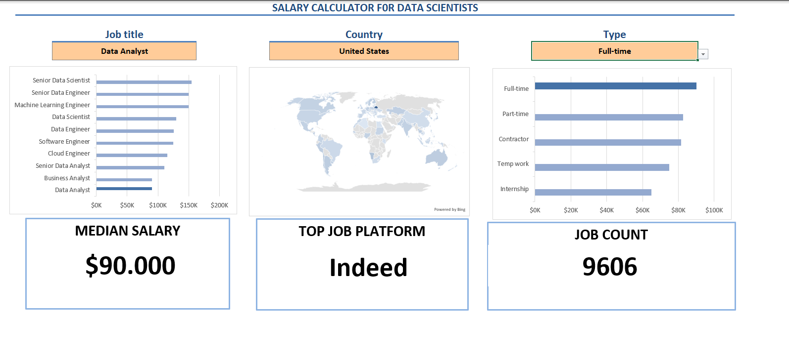
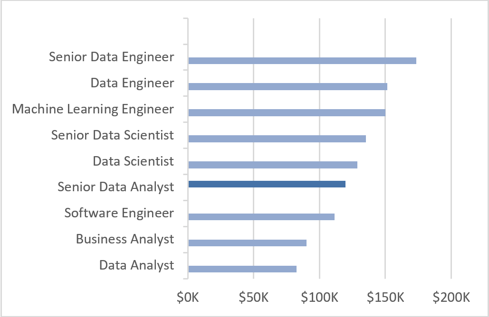
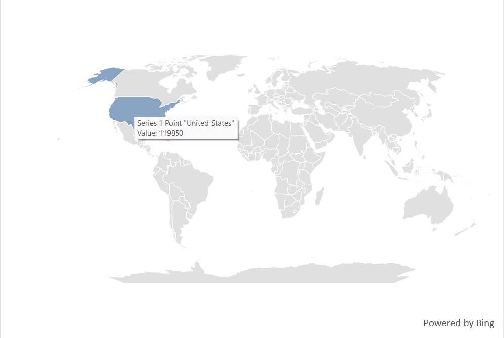
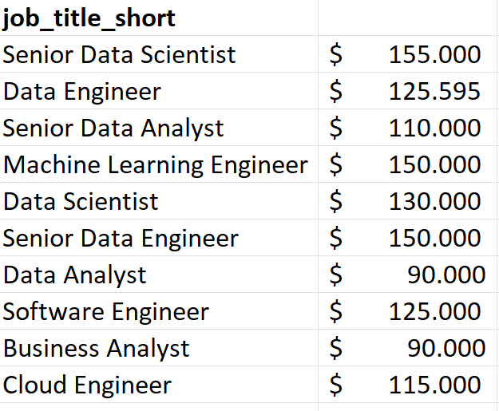
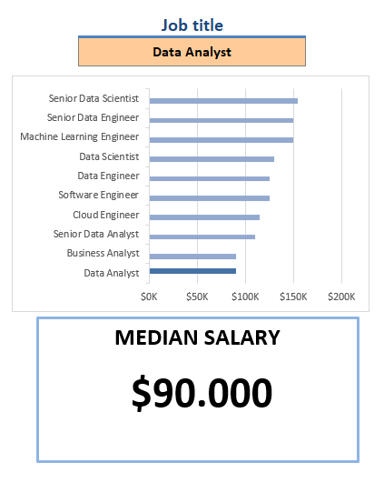
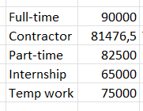
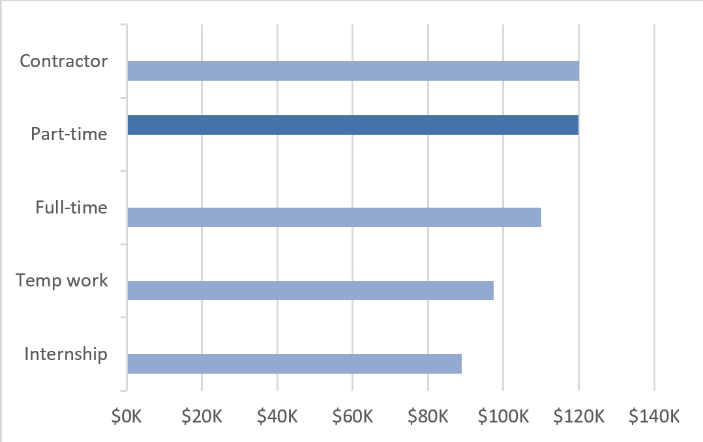
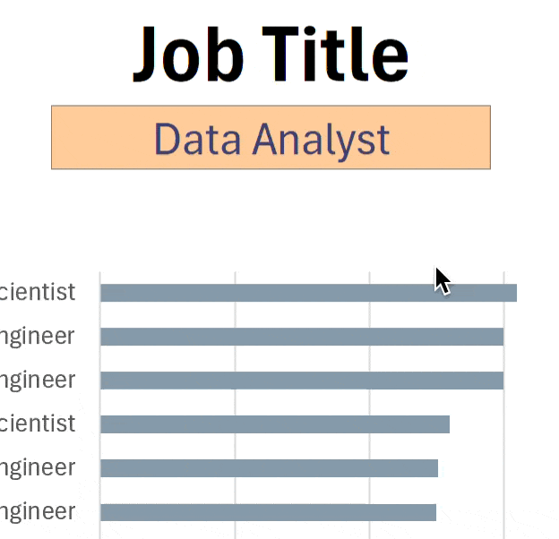

# Excel Salary Dashboard


## Introduction

This dashboard explores salary trends in the tech job market, with a focus on understanding how different roles and skills are valued.

The goal of this project is to provide a clearer view of compensation across positions, helping to identify patterns in salaries and demand for specific skills.

The dataset includes information on job titles, salaries, locations and required skills, which have been analyzed and visualized using Excel.
### Dashboard File

My final dashboard is in [Project_1_Dashboard.xlsx](Project_1_Dashboard.xlsx)
### Excel Skills Used

The analysis was carried out using core Excel functionalities, including data visualization, formulas and structured data validation techniques.

### Dataset

The dataset contains information on data-related roles, including job titles, salaries, locations and required skills. It was used to explore salary trends and better understand how different roles and skill sets are valued in the market.
## Dashboard Build

### Charts

#### Data Science Job Salaries – Bar Chart



- **Excel Features:** Bar chart with formatted salary values and a clean layout for clarity.
- **Design Choice:** Horizontal bar chart to allow easier comparison between roles.
- **Data Organization:** Job titles sorted by descending median salary.
- **Insight:** Senior roles and engineering positions tend to offer higher salaries compared to analyst roles.

#### Country Median Salaries – Map Chart



- **Excel Features:** Map chart used to display median salaries by country.
- **Design Choice:** Color scale to highlight differences across regions.
- **Data Representation:** Median salary aggregated at country level.
- **Insight:** Clear differences appear across regions, highlighting higher-paying and lower-paying markets.
### Formulas and Functions

#### Median Salary by Job Titles
```
=MEDIAN(
IF(
    (jobs[job_title_short]=A2)*
    (jobs[job_country]=country)*
    (ISNUMBER(SEARCH(type,jobs[job_schedule_type])))*
    (jobs[salary_year_avg]<>0),
    jobs[salary_year_avg]
)
)
```

- **Multi-criteria filtering:** Filters data by job title, country, schedule type and excludes missing salary values.
- **Array formula:** Uses the `MEDIAN()` function combined with a nested `IF()` to evaluate multiple conditions.
- **Analytical purpose:** Calculates the median salary based on selected parameters such as role, location and job type.
- **Application:** This formula is used to populate the dashboard, providing a dynamic view of salary trends.
### Background Table



### Dashboard Implementation



#### Count of Job Schedule Type
```
=FILTER(J2#,(NOT(ISNUMBER(SEARCH("and",J2#))+ISNUMBER(SEARCH(",",J2#))))*(J2#<>0))
```

- **Filtering logic:** This formula uses `FILTER()` to exclude entries containing "and", commas, or zero values.
- **Purpose:** It generates a clean list of job schedule types for further use in the dashboard.

### Background Table



### Dashboard Implementation



### Data Validation

#### Filtered List

- **Data validation setup:** The filtered list is used as a validation rule for job title, country and type selections.
- **Benefit:** This ensures consistent input and improves the usability of the dashboard.



## Conclusion

This project explores salary trends across different data-related roles, highlighting how factors such as job title, location and type influence compensation.

As a Business and Technology student with a strong interest in data analysis and the job market, I find this type of analysis particularly relevant. It allows me to better understand how data can be used to support decision-making in real-world contexts, especially in areas such as careers, salaries and market demand.
